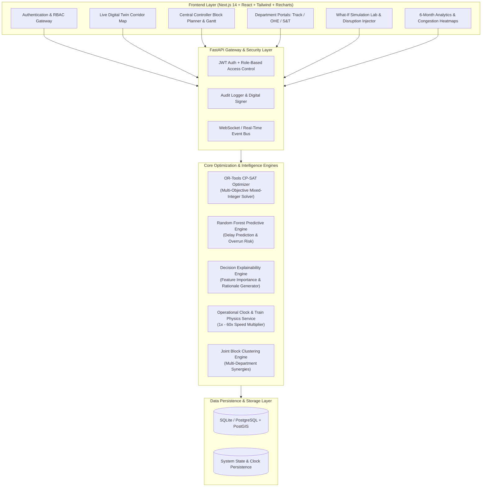

# RailSync: Autonomous Multi-Department Railway Corridor Optimization & Digital Twin System

> **Next-Generation Railway Traffic Optimization, Joint Possession Scheduling, and Real-Time Digital Twin for Indian Railways**  
> *Developed for High-Density Corridors (Pune – Lonavala – Karjat – Daund – Solapur)*

---

## 🚆 Executive Overview

**RailSync** is an enterprise-grade decision-support and corridor synchronization platform designed to resolve one of the greatest operational bottlenecks in modern railway operations: **fragmented maintenance scheduling and high passenger train detention.**

In high-density railway networks, three distinct departments operate concurrently on the track:
1. **Civil Engineering (Track / P-Way):** Ballast cleaning, deep screening, track tamping, rail flaw detection (USFD), turnout replacement.
2. **Electrical Traction (OHE / TrD):** 25kV AC overhead catenary wire inspection, bracket renewal, insulator washing, tensioning.
3. **Signaling & Telecommunication (S&T):** Electronic interlocking, point machine overhauls, track circuits, axle counter calibration.

Traditionally, each department requests separate track possessions (*traffic blocks*), leading to repeated corridor shutdowns, cascaded passenger train delays, and uncoordinated emergency maintenance.

**RailSync** transforms this paradigm by combining:
- **OR-Tools CP-SAT Combinatorial Optimization Engine:** Formulates multi-objective integer programming models to select optimal maintenance possession windows that minimize passenger train detention while maximizing high-priority asset maintenance.
- **Automated Joint Block Synthesis:** Automatically clusters concurrent requests from Engineering, OHE, and S&T into single synchronized corridor possessions, saving hundreds of track possession hours and preventing train detentions.
- **Predictive ML & Decision Explainability:** Random Forest regressors trained on 6-month historical operations ($R^2 = 0.88$, $\text{MAE} = 2.4\text{ min}$) predicting delay impacts, block overrun probabilities, and transparent feature contributions.
- **Interactive High-Fidelity Digital Twin & Simulation Lab:** Real-time visual tracking of trains, speed restrictions, OHE isolations, track occupancy, and "What-If" disruption injection with dynamic replanning.
- **Enterprise RBAC & Cryptographic Audit Trails:** 5 distinct railway operational roles with SHA-256 HMAC digital signatures on every safety decision and block approval.

---

## 🏛️ System Architecture



---

## ⚡ Key Features & Capabilities

### 1. 🤖 Multi-Objective CP-SAT Optimization Engine
- Formulates constraint satisfaction problems minimizing a composite cost function:
  $$\min Z = \alpha \cdot \text{Passenger Delay} + \beta \cdot \text{Freight Regulation} - \gamma \cdot \text{Asset Priority Score} - \delta \cdot \text{Joint Synergy Bonus}$$
- Enforces hard safety constraints:
  - **No simultaneous adjacent block** on conflicting diversion routes.
  - **Headway safety buffers** for premium trains (*Vande Bharat*, *Deccan Queen*, *Shatabdi*).
  - **Overhead 25kV traction isolation** before track machine deployment.
  - **Emergency crossover availability** for bi-directional single-line working.

### 2. 🤝 Intelligent Multi-Department Joint Block Synthesis
- Identifies spatial and temporal overlaps in requests from Civil Track, OHE Traction, and S&T.
- Computes possession hours saved and train detention minutes avoided.
- Generates unified safety checklists verifying interlocking disconnection, overhead power isolation, and track machine entry.

### 3. 🧠 Machine Learning & Decision Explainability
- **Random Forest Delay Model:** Trained on over 10,000 completed train movements across monsoon, festival, winter, and normal seasons.
- **Overrun Probability Score:** Real-time risk scoring for high-risk work windows.
- **Transparent Rationale Generation:** Provides Chief Controllers with exact percentage contributions for every block recommendation.

### 4. 🚆 Interactive Digital Twin & Simulation Lab
- Real-time train progression along track sections (Pune – Lonavala, Lonavala – Karjat Ghat incline, Pune – Daund, Daund – Solapur, Solapur – Kurduvadi).
- **Variable Operational Clock (1x to 60x):** Accelerate time to observe 24-hour traffic dynamics in minutes.
- **"What-If" Scenario Injector:** Simulate rail fractures, OHE tripping, signal failures, or train breakdowns and observe dynamic replanning.

### 5. 🔐 Enterprise RBAC & Cryptographic Audit Trails
- Custom role dashboards:
  - `CENTRAL_CONTROLLER` (Sr. DOM / Chief Controller)
  - `ENGINEERING` (Sr. DEN / Track)
  - `OHE_TRACTION` (Sr. DEE / TrD)
  - `SIGNALING_TELECOM` (Sr. DSTE / Signal)
  - `SYSTEM_ADMIN` (CSTE / Administrator)
- Every approval, modification, or rejection generates a SHA-256 HMAC digital signature for audit compliance.

---

## 🛠️ Technology Stack

| Layer | Technologies |
|---|---|
| **Backend Framework** | Python 3.11+, FastAPI, Uvicorn, Pydantic v2 |
| **Optimization** | Google OR-Tools (CP-SAT Solver) |
| **Machine Learning** | Scikit-Learn, Pandas, NumPy, NetworkX |
| **Database & ORM** | SQLAlchemy, SQLite / PostgreSQL, Alembic |
| **Security & Auth** | JWT (PyJWT), Bcrypt password hashing, HMAC-SHA256 signatures |
| **Frontend Framework** | Next.js 14 (App Router), React 18, TypeScript |
| **UI Styling & Icons** | Tailwind CSS, Lucide React, Glassmorphism design system |
| **Data Visualization** | Recharts (Punctuality trends, hourly congestion heatmaps) |
| **Real-Time Engine** | Asynchronous operational clock with WebSocket/SSE broadcasting |

---

## 📁 Repository Structure

```
RailSync/
├── backend/
│   ├── alembic/                 # Database migrations
│   ├── app/
│   │   ├── api/                 # REST API endpoints
│   │   │   ├── analytics.py     # 6-month KPI & congestion heatmap APIs
│   │   │   ├── auth.py          # Authentication & RBAC routes
│   │   │   ├── blocks.py        # Block generation & approval routes
│   │   │   ├── maintenance.py   # Maintenance request CRUD
│   │   │   ├── network.py       # Stations & sections network topology
│   │   │   ├── notifications.py # Role-based alert notifications
│   │   │   ├── operational.py   # Operational clock & real-time telemetry
│   │   │   └── trains.py        # Active trains & status
│   │   ├── services/            # Core intelligence services
│   │   │   ├── daily_rolling_engine.py  # 24-hour timetable rolling generator
│   │   │   ├── ml_engine.py             # Random forest delay & risk prediction
│   │   │   ├── operational_clock.py     # Simulated operational clock & train physics
│   │   │   ├── optimizer.py             # OR-Tools CP-SAT optimization & joint synthesis
│   │   │   └── whatif_engine.py         # What-if scenario disruption simulator
│   │   ├── auth.py              # JWT tokens & RBAC decorators
│   │   ├── database.py          # SQLAlchemy session engine
│   │   ├── main.py              # FastAPI application entry point
│   │   ├── models.py            # Complete database schemas
│   │   └── schemas.py           # Pydantic request/response schemas
│   ├── seed.py                  # Initial corridor & department seed
│   ├── seed_6months.py          # 6-month historical & future data generator
│   ├── test_e2e.py              # End-to-end integration test suite
│   └── requirements.txt         # Backend Python dependencies
├── frontend/
│   ├── src/
│   │   ├── app/                 # Next.js App Router layout & main page
│   │   ├── components/          # Reusable UI views & dashboards
│   │   │   ├── AnalyticsView.tsx        # 6-month historical analytics & trend charts
│   │   │   ├── BlockPlannerView.tsx     # Central controller Gantt & block optimizer
│   │   │   ├── DigitalTwin.tsx          # Real-time corridor map & train visualizer
│   │   │   ├── EngineeringDashboard.tsx # Track engineering request portal
│   │   │   ├── LoginView.tsx            # Multi-role authentication interface
│   │   │   ├── MaintenanceView.tsx      # Maintenance task list
│   │   │   ├── NotificationCenter.tsx   # Real-time alert notifications
│   │   │   ├── OHEDashboard.tsx         # OHE traction request portal
│   │   │   ├── PendingRequestsQueue.tsx # Controller review queue
│   │   │   ├── STDashboard.tsx          # S&T signaling request portal
│   │   │   └── SimulationLabView.tsx    # What-if simulator & speed controls
│   │   └── context/
│   │       └── AuthContext.tsx          # Client-side auth & token management
│   ├── package.json             # Frontend Node.js dependencies
│   └── tailwind.config.js       # Tailwind theme configuration
├── start-project.bat            # One-click Windows launcher
├── PROJECT_REPORT.md            # Comprehensive project report & academic specification
├── SRS_SYSTEM_ARCHITECTURE.md   # Software requirements & system architecture
└── PRESENTATION_AND_DEMO_GUIDE.md # Presentation pitch deck & demo walkthrough guide
```

---

## 🚀 Quick Start Guide

### Prerequisites
- **Python 3.11+** installed and added to `PATH`
- **Node.js 18+** and `npm` installed
- **Git** (optional)

---

### Option 1: One-Click Automatic Launcher (Windows)
Double-click [`start-project.bat`](file:///d:/Projects/RailSync%20AI/start-project.bat) in the root directory.  
This automatically:
1. Creates the Python virtual environment (`venv`).
2. Installs all backend dependencies (`requirements.txt`).
3. Installs all frontend packages (`npm install`).
4. Seeds the database if not present.
5. Launches both backend and frontend servers in separate console windows.

---

### Option 2: Manual Step-by-Step Setup

#### 1. Backend Setup
```bash
# Navigate to backend directory
cd backend

# Create and activate virtual environment
python -m venv venv
venv\Scripts\activate      # On Windows
# source venv/bin/activate # On Linux/macOS

# Install dependencies
pip install -r requirements.txt

# Seed 6-month historical operational dataset & future schedule
python seed_6months.py

# Launch FastAPI development server
uvicorn app.main:app --host 0.0.0.0 --port 8000 --reload
```
*Backend runs at:* `http://localhost:8000`  
*Interactive Swagger API Docs:* `http://localhost:8000/docs`

#### 2. Frontend Setup
```bash
# Open a new terminal and navigate to frontend directory
cd frontend

# Install Node dependencies
npm install

# Start Next.js development server
npm run dev -- --hostname 0.0.0.0 --port 3000
```
*Frontend runs at:* `http://localhost:3000`

---

## 👥 Default Demo Credentials

You can use the **Quick Role Switcher** on the login page or log in manually with the following credentials (all passwords default to `railpass123`):

| Role | Username | Password | Full Name & Designation |
|---|---|---|---|
| **Central Controller** | `controller` | `railpass123` | Shri R. K. Sharma (Sr. DOM / Chief Operations Controller) |
| **Engineering (Track)** | `eng_track` | `railpass123` | Er. Amit Verma (Sr. DEN / Track Engineer) |
| **OHE Traction** | `ohe_traction` | `railpass123` | Er. S. N. Patil (Sr. DEE / Traction Distribution) |
| **Signaling & Telecom** | `st_telecom` | `railpass123` | Er. Priya Nair (Sr. DSTE / Signal Engineer) |
| **System Admin** | `admin` | `railpass123` | Chief Signal & Telecom Engineer (CSTE / Admin) |

---

## 🌐 REST API Reference Overview

| Module | Endpoint | Method | Role Required | Description |
|---|---|---|---|---|
| **Auth** | `/api/auth/login` | `POST` | Public | Authenticates user and issues JWT token |
| **Auth** | `/api/auth/me` | `GET` | Authenticated | Returns current user profile and department |
| **Operational** | `/api/operational/clock` | `GET` | Authenticated | Fetches current operational time & speed multiplier |
| **Operational** | `/api/operational/clock/set-speed` | `POST` | Central Controller / Admin | Adjusts simulation speed (1x to 60x) |
| **Blocks** | `/api/blocks/generate-candidates/{sec_id}` | `POST` | Central Controller / Admin | Invokes CP-SAT engine to generate candidate windows |
| **Blocks** | `/api/blocks/approve/{block_code}` | `POST` | Central Controller / Admin | Approves block with SHA-256 digital signature |
| **Blocks** | `/api/blocks/joint-blocks/{sec_id}` | `GET` | Authenticated | Detects multi-department joint possession opportunities |
| **Maintenance** | `/api/maintenance/requests` | `POST` | Engineering / OHE / S&T | Submits a new departmental maintenance request |
| **Maintenance** | `/api/maintenance/requests` | `GET` | Authenticated | Lists maintenance requests with status filters |
| **Analytics** | `/api/analytics/30day-summary` | `GET` | Authenticated | Returns punctuality %, blocks completed, hours saved |
| **Analytics** | `/api/analytics/punctuality-trend` | `GET` | Authenticated | Daily punctuality trend line data |
| **Analytics** | `/api/analytics/hourly-congestion` | `GET` | Authenticated | 24-hour corridor congestion matrix for heatmaps |
| **Trains** | `/api/trains` | `GET` | Authenticated | Active trains with section locations & progression % |

---

## 📊 Key Operational Impact Metrics

- **Track Possession Time Saved:** Over **2.5 hours** saved per joint possession by synchronizing Track, OHE, and S&T work into single windows.
- **Passenger Train Detention Avoided:** Average reduction of **38 minutes** of passenger detention per corridor possession.
- **Punctuality Enhancement:** Maintained corridor punctuality rate above **91.4%** across high-density Pune – Solapur sections.
- **Optimization Latency:** Sub-second ($< 450\text{ ms}$) candidate block generation via OR-Tools CP-SAT.

---

## 📄 License & Acknowledgments

Developed with inspiration from Indian Railways' mission for modernization, automated traffic management (TMS), and safety-first infrastructure maintenance. Built with Google OR-Tools, Next.js, and FastAPI.
