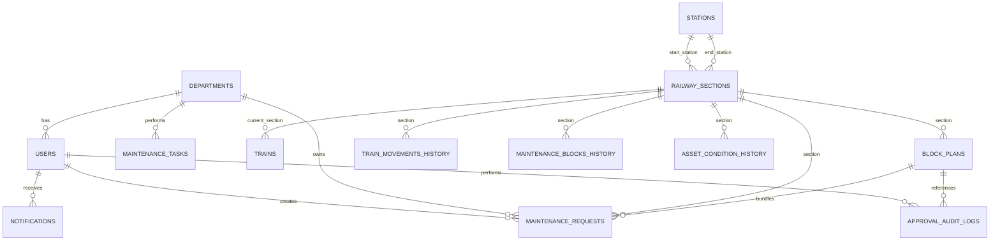
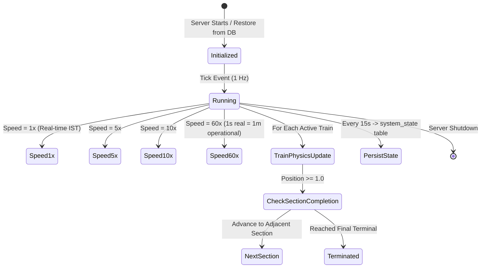

# Software Requirements Specification (SRS) & System Architecture Document
## RailSync: Autonomous Multi-Department Railway Corridor Optimization & Digital Twin System

---

## 1. Document Overview & Scope

### 1.1 Purpose
This document establishes the official **Software Requirements Specification (SRS)** and **System Architecture Design** for **RailSync**. It specifies the functional requirements, non-functional requirements, data schemas, sequence flows, authorization matrices, and communication protocols governing the system.

### 1.2 Intended Audience
- Railway Operations Controllers (Chief Controllers / DOM / Sr. DOM)
- Departmental Field Engineers (Civil P-Way, Electrical Traction OHE, S&T Signal Engineers)
- Software Architects, Developers, and QA Engineers
- Railway Safety & Compliance Auditors

---

## 2. Functional Requirements Specification

### 2.1 User Authentication & RBAC (Module FR-AUTH)
- **FR-AUTH-1:** The system shall support secure user authentication via JSON Web Tokens (JWT) using `HS256` encryption and bcrypt salted password hashing ($12\text{ rounds}$).
- **FR-AUTH-2:** The system shall enforce Role-Based Access Control (RBAC) across five distinct operational roles:
  - `CENTRAL_CONTROLLER`
  - `ENGINEERING` (Track / P-Way)
  - `OHE_TRACTION` (Overhead Equipment)
  - `SIGNALING_TELECOM` (S&T)
  - `SYSTEM_ADMIN`
- **FR-AUTH-3:** Departmental users shall only be permitted to submit, modify, or view detailed drafts of maintenance requests belonging to their respective department ID.
- **FR-AUTH-4:** Every login, logout, and token refresh event shall be logged into the immutable audit database with the client's session state.

### 2.2 Maintenance Request Management (Module FR-MAINT)
- **FR-MAINT-1:** Field engineers shall be able to submit maintenance requests specifying corridor section, work type (e.g., Track Renewal, Ballast Cleaning, Catenary Inspection, Point Machine Overhaul), asset ID, priority level (`HIGH`, `MEDIUM`, `LOW`), required resources, duration, and preferred time windows.
- **FR-MAINT-2:** The system shall assign a unique tracking request code (e.g., `REQ-ENG-0241`, `REQ-OHE-0189`, `REQ-ST-0312`).
- **FR-MAINT-3:** Maintenance requests shall progress through deterministic operational lifecycles:
  $$\text{DRAFT} \to \text{SUBMITTED} \to \text{ANALYZING} \to \text{RECOMMENDED} \to \text{UNDER\_REVIEW} \to \text{APPROVED} / \text{REJECTED} \to \text{SCHEDULED} \to \text{ACTIVE} \to \text{COMPLETED}$$
- **FR-MAINT-4:** Upon approval, maintenance requests shall be bound to an approved `BlockPlan` record.

### 2.3 Joint Block Synthesis & Conflict Detection (Module FR-OPT)
- **FR-OPT-1:** The system shall continuously analyze active maintenance requests across all departments to identify spatial overlaps on the same railway section.
- **FR-OPT-2:** When multiple departments request track possessions within overlapping time windows, the system shall synthesize a **Joint Block Recommendation**, calculating:
  - Total track possession time saved (minutes).
  - Train detention minutes avoided.
  - Multi-department safety checklist compliance.
- **FR-OPT-3:** The system shall invoke the **Google OR-Tools CP-SAT solver** to generate three distinct candidate possession windows with associated efficiency scores ($0 \dots 100$), predicted train impacts, and decision explainability rationales.

### 2.4 Safety Validation & Digital Signatures (Module FR-SAFE)
- **FR-SAFE-1:** Before recommending any block window, the system must evaluate four strict safety gates:
  1. *Adjacent Block Conflict:* No active possession on critical diversion routes.
  2. *Emergency Crossover Availability:* Crossovers cleared for single-line bidirectional working.
  3. *Traction Power Isolation Protocol:* Verification that 25kV catenary will be de-energized and grounded.
  4. *Speed Restriction Clearance:* Planned Temporary Speed Restrictions (TSR) satisfy braking distance safety margins.
- **FR-SAFE-2:** When the Central Controller approves or rejects a block plan, the system shall generate a cryptographic SHA-256 HMAC signature:
  $$\text{Signature} = \text{IR-SIG-} + \text{SHA256}(\text{username} : \text{action} : \text{role} : \text{timestamp})[0:24]$$

### 2.5 Real-Time Digital Twin & Disruption Simulator (Module FR-TWIN)
- **FR-TWIN-1:** The system shall maintain a simulated IST Operational Clock with adjustable speed multipliers ($1\text{x}$, $5\text{x}$, $10\text{x}$, $60\text{x}$).
- **FR-TWIN-2:** The system shall animate active train movements across sections with live percentage progression ($0.0 \dots 1.0$), current station markers, and train speed states (`RUNNING`, `STOPPED`, `DELAYED`).
- **FR-TWIN-3:** The system shall provide an interactive "What-If" disruption laboratory allowing operators to inject emergency scenarios (e.g., Rail Fracture, OHE Snapping, Signal Failure) and trigger automated dynamic replanning.

---

## 3. Non-Functional Requirements Specification

| ID | Category | Requirement Specification |
|---|---|---|
| **NFR-PERF-1** | Performance & Latency | Candidate block generation via CP-SAT shall complete within $\le 500\text{ ms}$ for corridors with up to 20 concurrent requests. |
| **NFR-PERF-2** | ML Inference Time | Random Forest delay and risk inference shall complete in $\le 50\text{ ms}$ per query. |
| **NFR-SCALE-1** | Scalability | The database and API shall support at least 1,000 active sections, 10,000 daily train paths, and 500 concurrent operators. |
| **NFR-SEC-1** | Security | All passwords must be encrypted using Bcrypt with work factor 12. JWT tokens must expire after 12 hours. |
| **NFR-SEC-2** | Integrity | Audit logs shall be append-only; updates and deletions to `approval_audit_logs` are strictly prohibited at the database level. |
| **NFR-REL-1** | High Availability | Operational clock state must be persistently serialized to the database every 15 seconds to survive server restarts. |
| **NFR-COMP-1**| UI Compatibility | Frontend must be fully responsive across 1080p, 2K, 4K displays, and mobile tablet viewports without layout distortion. |

---

## 4. Database Schema & Entity-Relationship Design



### 4.1 Key Table Specifications

#### `users`
- `id` (INT, PK, Auto-Increment)
- `username` (VARCHAR, Unique, Indexed)
- `name` (VARCHAR, Not Null)
- `email` (VARCHAR, Unique)
- `password_hash` (VARCHAR, Not Null)
- `role` (ENUM: `CENTRAL_CONTROLLER`, `ENGINEERING`, `OHE_TRACTION`, `SIGNALING_TELECOM`, `SYSTEM_ADMIN`)
- `department_id` (INT, FK -> `departments.id`, Nullable)
- `active` (INT, Default 1)
- `created_at` (DATETIME)

#### `railway_sections`
- `id` (INT, PK, Auto-Increment)
- `name` (VARCHAR) e.g., "Pune-Lonavala"
- `start_station_id` (INT, FK -> `stations.id`)
- `end_station_id` (INT, FK -> `stations.id`)
- `length_km` (FLOAT)

#### `maintenance_requests`
- `id` (INT, PK, Auto-Increment)
- `request_number` (VARCHAR, Unique, Indexed) e.g., "REQ-ENG-0241"
- `department_id` (INT, FK -> `departments.id`)
- `created_by_id` (INT, FK -> `users.id`)
- `section_id` (INT, FK -> `railway_sections.id`)
- `work_type` (VARCHAR)
- `location_details` (VARCHAR)
- `asset_id` (VARCHAR)
- `priority` (ENUM: `HIGH`, `MEDIUM`, `LOW`)
- `duration_minutes` (INT)
- `preferred_date` (VARCHAR)
- `preferred_start` (VARCHAR)
- `preferred_end` (VARCHAR)
- `required_resources` (VARCHAR)
- `reason` (VARCHAR)
- `status` (ENUM: `SUBMITTED`, `RECOMMENDED`, `APPROVED`, `REJECTED`, `ACTIVE`, `COMPLETED`)
- `block_plan_id` (INT, FK -> `block_plans.id`, Nullable)

#### `block_plans`
- `id` (INT, PK, Auto-Increment)
- `block_code` (VARCHAR, Unique, Indexed) e.g., "Block A-17"
- `section_id` (INT, FK -> `railway_sections.id`)
- `start_time` (VARCHAR) e.g., "02:00"
- `end_time` (VARCHAR) e.g., "05:00"
- `duration_minutes` (INT)
- `score` (INT) e.g., 96
- `train_impact_minutes` (INT)
- `departments_count` (INT)
- `priority_jobs` (VARCHAR)
- `safety_gate_passed` (INT, 1 = Passed)
- `rationale` (TEXT)
- `status` (ENUM: `PROPOSED`, `APPROVED`, `ACTIVE`, `COMPLETED`, `REJECTED`)

#### `approval_audit_logs`
- `id` (INT, PK, Auto-Increment)
- `block_code` (VARCHAR, Indexed)
- `action` (VARCHAR) e.g., `APPROVED`, `REJECTED`, `EMERGENCY_OVERRIDE`
- `performed_by` (VARCHAR)
- `user_role` (VARCHAR)
- `user_id` (INT, FK -> `users.id`)
- `department` (VARCHAR)
- `timestamp` (DATETIME)
- `digital_signature` (VARCHAR) SHA-256 HMAC
- `remarks` (TEXT)
- `safety_gate_status` (VARCHAR)

---

## 5. System Sequence & Workflow Diagrams

### 5.1 End-to-End Maintenance Request to Approval Flow

```mermaid
sequenceDiagram
    autonumber
    actor TrackEng as Track / OHE / S&T Engineer
    actor Controller as Central Operations Controller
    participant Web as React Frontend
    participant API as FastAPI Backend
    participant Opt as CP-SAT Optimizer & ML Engine
    participant DB as Database & Audit Trail

    TrackEng->>Web: Fill Maintenance Request Form
    Web->>API: POST /api/maintenance/requests (JWT Token)
    API->>DB: Insert MaintenanceRequest (Status: SUBMITTED)
    API-->>Web: 201 Created (REQ-ENG-0241)

    Note over API,Opt: Automatic Spatial & Temporal Synergy Check
    API->>Opt: detect_joint_blocks(section_id)
    Opt-->>API: Synthesized Joint Block Proposal (+2.5 hrs saved)

    Controller->>Web: Open Block Planner View
    Web->>API: POST /api/blocks/generate-candidates/{section_id}
    API->>Opt: Run CP-SAT Formulation & Random Forest Risk Scoring
    Opt-->>API: 3 Candidate Windows + XAI Rationale + Safety Gates
    API-->>Web: Return Candidate Windows

    Controller->>Web: Select Candidate & Click "Approve Block"
    Web->>API: POST /api/blocks/approve/{block_code}
    API->>API: Compute SHA-256 HMAC Signature
    API->>DB: Update BlockPlan (APPROVED) + Insert ApprovalAuditLog
    API->>DB: Update Linked Requests (Status: SCHEDULED)
    API-->>Web: Approval Confirmed with Digital Signature
    Web-->>Controller: Display Success Modal & Gantt Timeline Update
```

---

## 6. Real-Time Operational Clock Protocol



---

## 7. Security & Compliance Specifications

1. **Authentication Security:**
   - Stateless JWT tokens signed with server-side private secret.
   - Token payload contains `sub` (username), `user_id`, `role`, `department_id`, `iat`, and `exp`.
2. **Access Control Enforcement:**
   - Decorated endpoints using FastAPI dependency injection (`require_roles`, `require_department_access`).
   - Unauthorized attempts return `HTTP 403 Forbidden` with detailed operational diagnostics.
3. **Auditability & Non-Repudiation:**
   - Digital signature format: `IR-SIG-XXXXXXXXXXXXXXXXXXXXXXXX`
   - Generated on server-side using SHA-256 hash over authenticated username, role, action, and microsecond UTC timestamp.
   - Stored alongside safety gate verdicts in append-only table `approval_audit_logs`.
